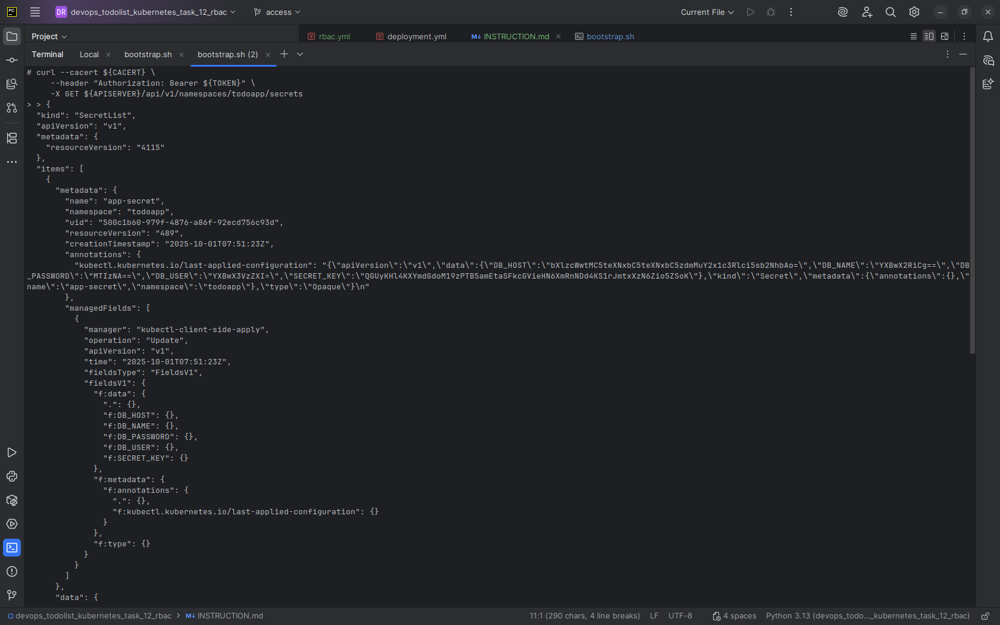

# ToDo App Kubernetes Deployment Instructions

This document explains how to validate the Kubernetes RBAC setup and access secrets from the `todoapp` Deployment pod.

---

## 1. Apply Infrastructure

Run the `bootstrap.sh` script to deploy all required resources:

```bash
./bootstrap.sh
````

This script will:

* Create namespaces, ConfigMaps, Secrets, Services, PVs, PVCs, Deployments, and StatefulSets
* Apply RBAC manifests
* Install the NGINX Ingress Controller

---

## 2. Verify Pods

Check that all pods in the `todoapp` namespace are running:

```bash
kubectl get pods -n todoapp
```

---

## 3. Access the Pod

Pick one of the pods from the previous command and enter its shell:

```bash
kubectl exec -it <pod-name> -n todoapp -- /bin/sh
```

---

## 4. List Secrets

Inside the pod, run the following `curl` command to list secrets in the `todoapp` namespace:

```bash
curl --cacert ${CACERT} \
     --header "Authorization: Bearer ${TOKEN}" \
     -X GET ${APISERVER}/api/v1/namespaces/todoapp/secrets
```

You should see the list of secrets.

---

## 5. Verify Output


